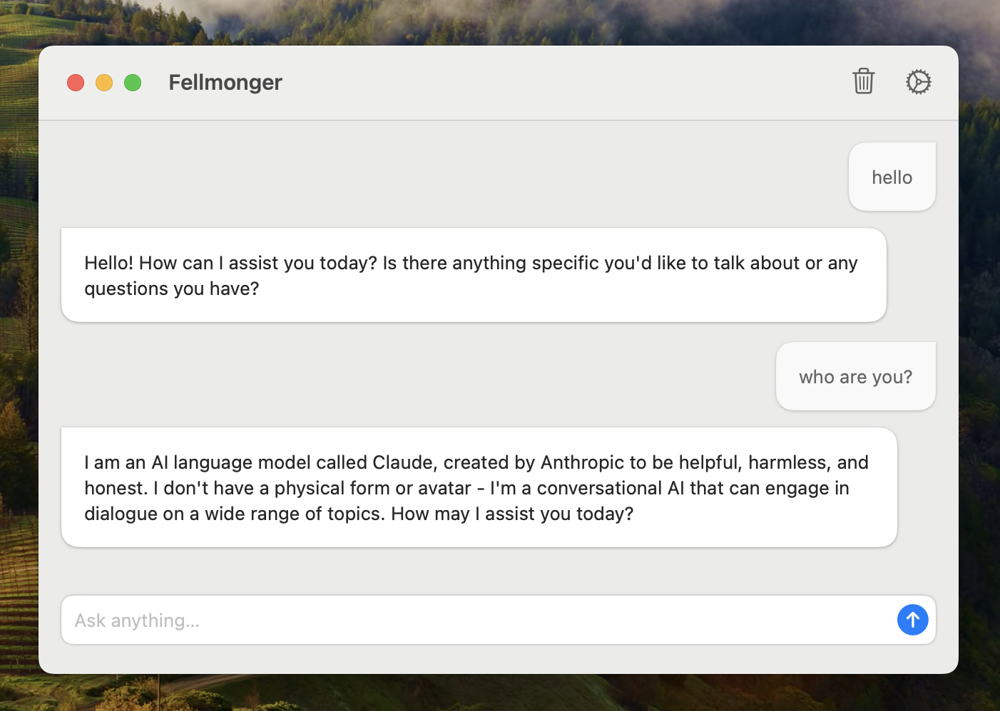
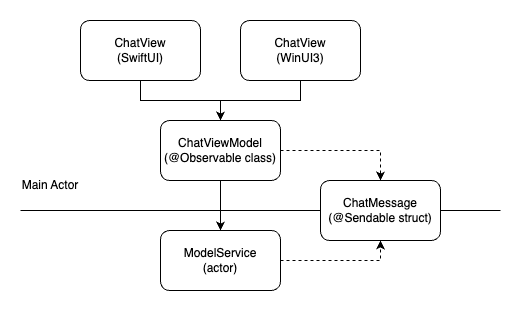

# Fellmonger

Fellmonger is an example project that showcases a native desktop application developed using **Swift 6**, compatible with both **macOS** and **Windows** platforms. It’s a native LLM client that supports Ollama, OpenAI, and Anthropic LLMs.

> 📚 This project is meant to be a learning resource for exploring cross-platform macOS/Windows Swift desktop application development. While primarily for my own learning, I hope it can benefit others too. 😄

The project is complex enough to represent a real application but is still at a prototype level. Many improvements can be made to make it production-ready, including UI/icon polish, feature enhancements, performance optimizations, better error handling and installer improvements.

Architectural decisions involve trade-offs. If you find these patterns useful, great! If you think this is overengineering or not the right tool for the job, that’s okay too. Use whatever fits your development process and team. The most important thing is to ship cool stuff to your users sustainably.

Feel free to create PRs to improve this project so we can discover and document useful patterns!

## Demo

[Watch it on YouTube](https://www.youtube.com/watch?v=EWep5eVI7EI)

## Supported LLM providers

You can select the active LLM provider and specific model name from the app Settings. At least one provider must be configured for the app to work properly.

| Model | Notes | Default model
| - | - | - |
| Ollama | Install Ollama and pull the desired model. By default, Fellmonger will try to use `localhost` to reach it but you can configure the URL from the Settings. | `llama3.1` |
| OpenAI | Get an OpenAI service account key and configure it in Settings. | `gpt-4o`
| Anthropic | Get an Anthropic service account key and configure it in Settings. | `claude-3-5-sonnet-20240620` |

## Tech Stack

The cross-platform application was implemented in [Swift 6](https://developer.apple.com/videos/play/wwdc2024/10169/).
- [Swift Package Manager](https://www.swift.org/documentation/package-manager/)
- [Swift Concurrency architecture](https://developer.apple.com/videos/play/wwdc2021/10194/)
- [Swift Macros](https://developer.apple.com/videos/play/wwdc2023/10166/)
- For Core:
    - [Swift Foundation](https://github.com/apple/swift-foundation)
    - [OpenCombine](https://github.com/OpenCombine/OpenCombine)
    - [OllamaKit](https://github.com/kevinhermawan/OllamaKit)
    - [OpenAI](https://github.com/MacPaw/OpenAI)
    - [SwiftAnthropic](https://github.com/jamesrochabrun/SwiftAnthropic)
- For macOS:
    - [Xcode 16.1 Beta](https://developer.apple.com/documentation/xcode-release-notes/xcode-16_1-release-notes) targeting macOS 14
    - [SwiftUI](https://developer.apple.com/xcode/swiftui/)
- For Windows:
    - [VScode](https://code.visualstudio.com/) with the [Swift extension from Swift Server Work Group](https://marketplace.visualstudio.com/items?itemName=sswg.swift-lang)
    - [Browser Company fork of Swift for Windows](https://github.com/thebrowsercompany/swift-build)
    - [swift-winui](https://github.com/thebrowsercompany/swift-winui)
    - [WiX 5](https://wixtoolset.org/docs/intro/)

## Setup for macOS development
From a macOS machine:
1. Pull the code
2. Open the macOS project in Xcode
3. Fix the potential signing issues you might have (select your user)
4. Build and run

## Setup for Windows development
You will need a Windows machine or a Windows VM. Only x64 is supported, so if you use a Windows VM from a Mac, it will need to be an x64 machine (not ARM).

The requirements are the same than [The Browser Company sample Windows app](https://github.com/thebrowsercompany/windows-samples): 
1. Install latest Swift SDK from [thebrowsercompany/swift-build](https://github.com/thebrowsercompany/swift-build/releases)
2. Visual Studio Community with C++ build tools
3. Make sure to have the appropriate version of the Windows App Runtime installed as mentioned [here](https://github.com/thebrowsercompany/swift-windowsappsdk?tab=readme-ov-file#using-windows-app-sdk)

### VSCode

VSCode is the editor of choice for developing Windows apps on Swift. You can install it from https://code.visualstudio.com/download. Install the [Swift extension from Swift Server Work Group](https://marketplace.visualstudio.com/items?itemName=sswg.swift-lang).

> ⚠️ In order for the extension to load the project, you will need to open the Windows Application [Package.swift](/Windows/Application/Package.swift) in VSCode first every time you restart VSCode.

- Building: The build of the Windows applications is done through SPM. This can be done on the command line with `swift build` or in Visual Studio Code with `Ctrl+Shift+B`.

- Debugging: Debugging in VSCode is supported through LLDB. You can simply press `F5` or navigate to the `Run and Debug` (`Ctrl+Shift+D`) pane.

If you need more guidance about how to setup Windows development, check [this blog post](https://www.itecheverything.com/post/how-to-get-started-with-swift-on-windows-swift-winrt) about it.

I remember I had to install Python (Swift for Windows dependency) and set up some environment variables after hitting some errors. If you really want to try to build it and these steps are not enough to have it working, please open an issue on this project and I will be happy to add more detailed steps to this guide.

## Architectural Patterns

This project explores various architectural patterns and practices for developing a cross-platform Swift application.

### Swift Package structure

The project is organized into three main directories:
- **Core**: Contains the shared code between the Windows and macOS applications.
- **MacOS**: Contains macOS-specific code.
- **Windows**: Contains Windows-specific code.

Each directory is structured into several Swift packages:
- [Core](/Core/): The core is small and could fit in a single package well by just using directories instead of subpackages. However, I wanted to split it into packages to excercise that approach which might be useful for more complex applications.
    - [SwiftExtensions](/Core/SwiftExtensions/): Swift utility methods and types.
    - [Settings](/Core/Settings/): Settings model and view models.
    - [Chat](/Core/Chat/): LLM client implementations and view models.
- [MacOS](/MacOS/): It's an Xcode project for a macOS application. It contains everything that can't be stored in a Swift package. All of it'
s code was pushed to subpackages.
    - [MacOSSwiftExtensions](/MacOS/MacOSSwiftExtensions/): macOS Swift extensions.
    - [MacOSSettings](/MacOS/MacOSSettings/): macOS views for settings.
    - [MacOSChat](/MacOS/MacOSChat/): macOS views for chat.
    - [MacOSRoot](/MacOS/MacOSRoot/): Root package for the macOS application. This is the only package the Xcode project imports.
- [Windows](/Windows/): 
    - [WinUIExtensions](/Windows/WinUIExtensions/): View model data binding utilities. Includes macros for that purpose.
    - [Application](/Windows/Application/): Single package implementation for the entire app. Buildable with Swift for Windows and contains dependencies on Windows frameworks. Derived from [The Browser Company sample Windows app](https://github.com/thebrowsercompany/windows-samples). It could be split down in more packages as the macOS app if needed but I decided to keep it in a single package to constrast it with the multiple package approach. Simplicity is always good, especially if you are not ripping off the benefits of a more modular architecture, for example, by adding [Dev Apps](https://medium.com/airbnb-engineering/designing-for-productivity-in-a-large-scale-ios-application-9376a430a0bf) in a large team/project.

### Modules

In the context of this project, **Modules** are a variation of the [Composition Root pattern](https://simonbs.dev/posts/introducing-the-composition-root-pattern-in-a-swift-codebase/). Modules allow Swift packages to export *living instances* of types, which helps with encapsulation and lifecycle management.

Key points about the Module pattern:
- Swift packages may contain a @MainActor class with the same name as the package, representing the module.
- Modules handle dependency injection manually, making external frameworks unnecessary.
- Modules are retained by clients, ensuring that infrastructure objects are managed by the client while being hidden internally.
- Modules have an init method that may include other modules as dependencies.

Both [`SettingsModule`](/Core/Settings/Sources/Settings/SettingsModule.swift) and [`ChatModule`](/Core/Chat/Sources/ChatModule.swift) are examples of this pattern. Both macOS and Windows applications link these modules to their respective views.

### MVVM with Observable

This project employs a variation of the [MVVM with Observable pattern](https://www.hackingwithswift.com/books/ios-swiftui/introducing-mvvm-into-your-swiftui-project). 

In this approach:
- **Models** are platform independent and might be one of two types:
    - **Data exchange models**: Value types (`structs` and `enums`) for data crossing the boundaries of the application
    - **Application models**: Value types and classes for internal application state that needs to be reused from multiple view models. 
- **View Models** are headless views that encapsulate UI state and behavior, using models for input or output. These are `@Observable @MainActor classes` and platform-independent.
- **Views** only know about the view models’ surface, implemented with `SwiftUI` on macOS and `WinUI3` on Windows.

This approach enables the reuse of models and view models across macOS and Windows applications. Models are implementation details of view models, so they are not necessarily exposed. The trade off here is consistency and reusability over flexibility and autonomy in the different platforms.

Windows Views are implemented using a hierarchy of WinUI `FrameworkElements`. The *View* layer is implemented following a pattern very similar to AppKit development with code-only view controllers: there's a `view` property on the view (controller) that exposes the root `FrameworkElement` and there's one `private(set) lazy var` per specific internal view. Finally, view model properties are bound to the view by using `withObservationTracking` for detecting changes in one direction and FrameworkElement event handlers for the other. This project explored using generic methods and custom macros to make it easier to set up the glue code for bindings in a way that's similiar to how data binding works in Windows applications.

Rendering view models from SwiftUI is straightforward with a SwiftUI View. View/ViewModel binding is done implictly by using the `@Observable` view model from the view `body`. 

When it's not straightforward to use the default view model implementation in a SwiftUI preview, a protocol can be used for the view model. In that case, there would be two concrete implementations for the view model in the project: a mock for the previews and the real one. A custom [`@BindableProtocol`](MacOS/MacOSSwiftExtensions/Sources/MacOSSwiftExtensions/SwiftUI/BindableProtocol.swift) implementation was implemented for that purpose. Using existential types as view dependencies might theoretically cause performance penalties but I haven't found evidence of this to actually become a real problem in this context.

MVVM with Observable on SwiftUI might feel a bit strange, specially coming from the traditional SwiftUI data flow which encourages the use of @State and value types instead of classes. In a way, this feels like opting out of the efficient SwiftUI diffing mechanism and doing it manually in a more hand crafted way with classes, i.e. more work for the developer. Also, many SwiftUI native tools (`@Environment`, `@AppStorage`, `@Query`) [don't work in this approach](https://medium.com/@redhotbits/from-swiftui-vanilla-to-mvvm-like-a-pro-470b22f304c9). However, this approach has some benefits that might make it worth for complex applications:
- View Models can be reused in macOS and Windows
- View and View Model concerns are better defined so there's a better separation of responsibilities and a more predictable codebase overall
- Views can be easily set up in the exact desired state for previews
- Scope of change when data changes is smaller so this should be more performant.

[ChatView (Windows)](/Windows/Application/Sources/Chat/ChatView.swift), [ChatView (macOS)](/MacOS/MacOSChat/Sources/MacOSChat/ChatView.swift), [ChatViewModel](/Core/Chat/Sources/ChatViewModel.swift) and [ChatMessage](/Core/Chat/Sources/ModelServices/ModelService.swift) are examples of Views, View Models, and Models respectively.

### Dependency Injection

This project leverages [Dependency Injection](https://en.wikipedia.org/wiki/Dependency_injection) extensively: 
- Types focus on their primary responsibilities, making the codebase more maintainable and easier to test.
- Dependency Injection is used consistently throughout the stack:
  - *View Models* are injected into *Views*. This allows *Views* to focus only on the platform specific rendering of the *View Models*.
    - In SwiftUI previews, mock view models can be injected allowing the developer to render the previews in the exact specific desired state easily.
  - Services are injected into View Models and other Services.
  - Modules are injected into other modules.

Dependency injection ensures that types don’t create their dependencies, and instead assume that dependencies are created and passed to them by someone else, typically in Modules.

Note we are not using `@Environment` from SwiftUI at all. We can't do it in the first place since we want reusable cross platform *View Models*.

Also, this flavor of dependency injection has some nice properties:
- Type safe
    - No errors at runtime
    - No requirements of default values (that might need their dependencies as well)
    - Compiler will force you to create the right dependency graph... otherwise it won't compile.
- No external dependency injection framework is used. 
- Lifecycle of objects is explicit by using the *Modules* pattern.

### Services

*Service* is an overloaded term in software developement but within this project it has specific semantics.
Services are abstractions for interacting with remote systems or persistence. They provide a straightforward API that hides the details of these interactions.
- *Services* are usually implemented as `actors`.
    - This allows embracing the [Swift Concurrency architecture](https://developer.apple.com/videos/play/wwdc2021/10194/) which enables better multithreading usage in a safe way.
- Other dependencies or configuration might be injected into them.
- *Services* are injected into *View Models*
- *Services* are usually stateless gateways for data operations. The mutable state of the application is usually stored in *View Models* or *Application Models*.
- *Models* are usually implemented as value types that go through the API of *Services*. 

[OllamaService](/Core/Chat/Sources/ModelServices/OllamaService.swift), [OpenAIService](/Core/Chat/Sources/ModelServices/OpenAIService.swift), [AnthropicService](/Core/Chat/Sources/ModelServices/AnthropicService.swift) and [ConfigurationPersistenceService](/Core/Settings/Sources/Settings/ApplicationModel/ConfigurationPersistenceService.swift) are examples of services.

## Main challenges found while trying Swift on Windows

I wrote down a list of issues that I found while pushing this project forward. While they caused a bit of additional work, all of them can be worked around.

### Swift Foundation is not source compatible with Foundation
- `URLSession` is part of `FoundationNetworking` instead of `Foundation`. Conditional imports are required.
- `URLSession` lacks the `bytes` member in `FoundationNetworking`. Custom implementations are necessary.
- `URLSessionDelegate` behaves differently on macOS and Windows. Various approaches were explored to ensure consistent behavior across both platforms.
- `UserDefaults` is not persistent in Swift Foundation on Windows. Custom settings persistence was implemented using UserDefaults on macOS and the Windows Registry on Windows.

The fixes become straightforward once you understand how to do them but it might be a bit intimidating at first.

I also found [Alamofire comments](https://github.com/Alamofire/Alamofire?tab=readme-ov-file#known-issues-on-linux-and-windows) about [swift-corelibs-foundation](https://github.com/apple/swift-corelibs-foundation) reliablity and left me a bit concerned. I didn't hit blocking issues myself though.

### Swift for Windows limitations
- `CommandBar` is not available by default in [swift-winui](https://github.com/thebrowsercompany/swift-winui), but can be added to [projections.json](https://github.com/thebrowsercompany/swift-winui/blob/main/projections.json).
- The [community-toolkit](https://github.com/CommunityToolkit/Windows), an Open Source framework for common components like Settings views, is not available to Swift because it is implemented in C#. I had to implement some of these components manually in Swift.
- swift-winui doesn't support ARM yet. I had to use an Intel-based Windows machine or Intel Mac. ARM support is expected soon.
- Swift Testing import isn't found on Swift for Windows.
- Macros tests don’t work due to multiple entry points error in Windows.

### VScode Swift extension can be improved
- VScode Swift extension doesn't support ARM yet. This would be useful to develop from Apple ARM machines in Parallels. This would make it way easier and faster to code in Swift for Windows and macOS at the same time.
- Sometimes auto complete doesn't work well. It might show options that don't apply for the current context.
- Code formatting adds unnecessary new lines between imports and reorders comments undesirably.
- I needed to restart VScode every time I deleted a file due to errors
- Having to open the Windows application Package.swift file every time VScode is reopened to be able to build is a bit annoying.
- When debugging the app, a command line window is opened. However, logs don't show up in there if the debugger is attached. The only way to see the logs is to manually launch the debug build.

These are small things that should get better over time. They might have been fixed by the time you read this.

## Open Questions

I didn’t explore in detail creating high quality installers, how code signing works for Swift Windows applications and how to distribute updates. If you have insights into this, please let me know!

## Final Thoughts

The Browser Company has shown the path to use Swift for UI development on Windows. While there are areas for improvement in the developer experience, it’s a viable option for teams with strong Swift focus and backgrounds.

The patterns explored in this project have proven useful in refining and refactoring the application. However, there are many valid approaches to development —the key is delivering reliable and sustainable solutions to users.

This experiment has been incredibly rewarding! I’d love to hear your thoughts. Thanks for reading! 😊
